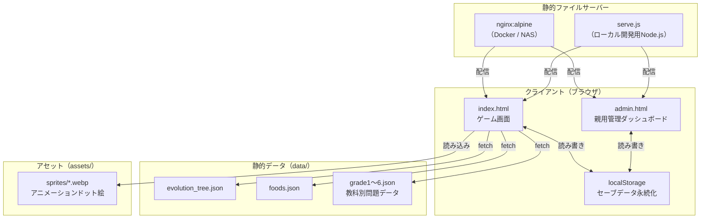
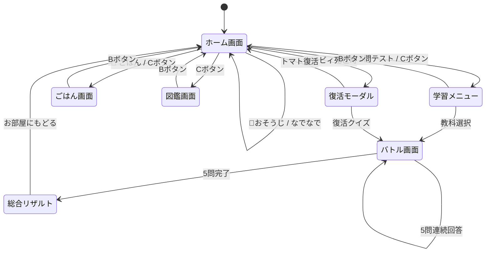
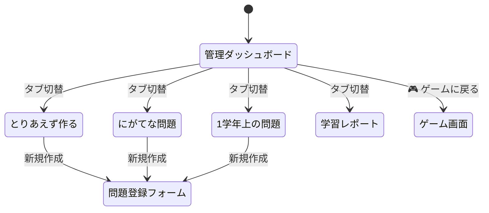
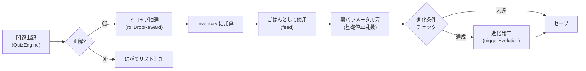
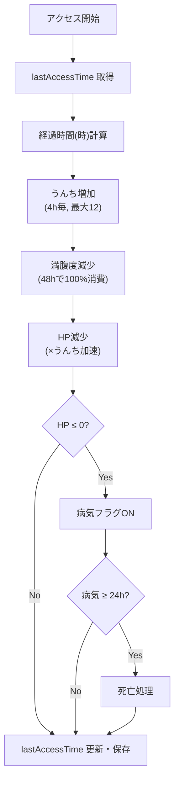
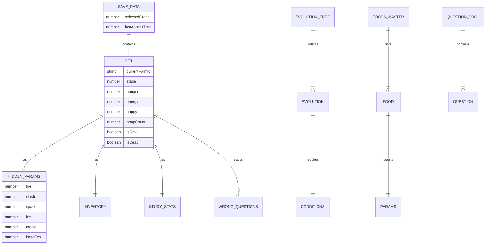

# 基本設計書

## ⭐ ぷぷぷ育成フレンズ（たまごっち風カービィ育成×テスト復習Webアプリ）

| 項目 | 内容 |
|------|------|
| プロジェクト名 | ぷぷぷ育成フレンズ（kirby-pet-study） |
| バージョン | 1.0.0 |
| ターゲットユーザー | 小学5年生（小1〜小6対応） |
| コンセプト | たまごっち風の育成ゲームとテスト復習を融合し、勉強のモチベーションを向上させる |
| デプロイ先 | NAS上のDockerコンテナ（nginx:alpine）、ローカル開発はNode.js |

---

## 1. システム概要

### 1.1 システムの目的

小学生が楽しみながらテスト復習を行えるWeb育成ゲーム。問題を解くとごちそう（報酬アイテム）が手に入り、カービィにあげることで裏パラメータが蓄積され、条件を満たすと4段階の進化が発生する。たまごっち同様のお世話要素（空腹度・HP・うんち・病気・死亡）により、継続的なアクセスを促す。

### 1.2 システム構成図



### 1.3 技術スタック

| レイヤー | 技術 | 選定理由 |
|----------|------|----------|
| フロントエンド | HTML5 + Vanilla JS (ES Modules) + CSS3 | 外部依存ゼロ、NAS上で即起動可能 |
| 音声 | Web Audio API（8bit合成） | ライブラリ不要で8bitサウンドを生成 |
| 画像 | WebPアニメーション（Pillow生成） | 軽量・アニメーション対応 |
| データ永続化 | localStorage | サーバーサイドDB不要、オフラインでも動作 |
| 配信（本番） | nginx:alpine（Docker） | 軽量・高速・NASデプロイ対応 |
| 配信（開発） | Node.js http モジュール（serve.js） | ゼロ依存、ポート自動リトライ |

---

## 2. 機能一覧

### 2.1 ユーザー向け機能（index.html）

| # | 機能名 | 概要 | 優先度 |
|---|--------|------|--------|
| F-01 | お部屋画面（ホーム） | カービィの現在状態を表示。ステータスバー（空腹度・HP・うんち数）、ペットスプライト、ふきだし、アクションボタン | 必須 |
| F-02 | 5問連続すいこみテスト | 教科・学年を選んで5問連続クイズ。正解で敵をすいこんでごちそうドロップ | 必須 |
| F-03 | ごはん画面 | 持っているごちそうをカービィに与える。裏パラメータ加算 | 必須 |
| F-04 | 図鑑画面 | アンロック済み進化形態の一覧。タップで着せ替え | 必須 |
| F-05 | おそうじ（うんち除去） | うんちをすいこみで掃除。清潔維持でHP減少抑制 | 必須 |
| F-06 | 進化システム | 裏パラメータ条件達成で自動進化。演出オーバーレイ表示 | 必須 |
| F-07 | ライフサイクル | 時間経過で空腹度・HP減少、うんち蓄積、病気・死亡判定 | 必須 |
| F-08 | オフライン差分計算 | 最終アクセス時刻から差分シミュレーションでステータス反映 | 必須 |
| F-09 | 死亡復活 | マキシムトマト使用 or 復活クイズ1問で復活 | 必須 |
| F-10 | 世代交代（転生） | 最終進化から24時間後にリセットしおむつカービィに戻る | 必須 |
| F-11 | にがてリベンジ | 過去に間違えた問題だけを出題するリベンジモード | 必須 |
| F-12 | 8bitサウンド | Web Audio APIによる操作音・正解音・すいこみ音・進化ファンファーレ | 必須 |

### 2.2 親用管理機能（admin.html）

| # | 機能名 | 概要 | 優先度 |
|---|--------|------|--------|
| A-01 | 問題登録（CRUD） | 4形式（4択/穴埋め/数字入力/長文読解）で問題を作成・編集・削除 | 必須 |
| A-02 | 3区分タブ管理 | 「とりあえず作る」「にがてな問題」「1学年上の問題」の3カテゴリ分類 | 必須 |
| A-03 | フィルタ・検索 | 学年・教科・キーワードで問題を絞り込み | 必須 |
| A-04 | JSONエクスポート | 作成した問題をJSONファイルとしてダウンロード | 必須 |
| A-05 | JSONインポート | JSONファイルから問題を一括読み込み | 必須 |
| A-06 | 学習レポート | 教科別正答率・総解答数・にがて問題数の分析表示 | 必須 |

---

## 3. 画面構成・画面遷移図

### 3.1 ゲーム画面（index.html）



### 3.2 管理画面（admin.html）



---

## 4. データフロー

### 4.1 クイズ→育成のデータフロー



### 4.2 オフライン差分計算フロー



---

## 5. データ設計（概要）

### 5.1 永続化方式

| データ種別 | ストレージ | キー名 |
|-----------|-----------|--------|
| セーブデータ（ペット状態・インベントリ・成績） | localStorage | `kirby_pet_savedata_v2` |
| 親作成のカスタム問題 | localStorage | `kirby_custom_questions_v1` |
| 学年別問題データ（プリセット） | 静的JSONファイル | `data/grade*.json` 他 |
| 進化ツリー定義 | 静的JSONファイル | `data/evolution_tree.json` |
| 食べ物マスタ | 静的JSONファイル | `data/foods.json` |

### 5.2 主要データ構造（概念）



---

## 6. 非機能要件

### 6.1 パフォーマンス

| 項目 | 要件 |
|------|------|
| ページロード | 3秒以内（ローカルネットワーク環境） |
| アニメーション | 60fps維持（WebPアニメーション軽量化） |
| データ保存 | localStorage即時書き込み（非同期不要） |

### 6.2 可用性・保守性

| 項目 | 要件 |
|------|------|
| オフライン動作 | 初回ロード後はネットワーク不要（静的ファイル+localStorage） |
| 外部依存 | ゼロ（npm installなし、CDN不要） |
| ブラウザ対応 | Chrome / Edge / Safari / Firefox (モダンブラウザ) |
| レスポンシブ | モバイル（320px〜）から デスクトップ（1280px+）まで対応 |
| データバックアップ | admin画面からJSON一括エクスポート/インポート |

### 6.3 デプロイ

| 項目 | 要件 |
|------|------|
| 本番環境 | Docker（nginx:alpine）でNASにデプロイ、ポート8080 |
| 開発環境 | `node serve.js` でポート3000（自動リトライ） |
| CI/CD | 手動デプロイ（`docker compose up -d --build`） |
| データ永続化 | docker-compose.yml で `./data` をボリュームマウント（問題追加即反映） |

### 6.4 セキュリティ

| 項目 | 要件 |
|------|------|
| 認証 | なし（家庭内LAN前提） |
| データ保護 | 裏パラメータはUI上非表示（localStorage上には保持） |
| 入力検証 | クイズ回答のサニタイズ（textContent使用、innerHTML不使用） |

---

## 7. ディレクトリ構成

```
kirby/
├── index.html              # ゲーム画面（メイン）
├── admin.html              # 親用管理ダッシュボード
├── serve.js                # ローカル開発用Webサーバー
├── package.json            # npm scripts定義
├── Dockerfile              # 本番用Dockerイメージ定義
├── docker-compose.yml      # Docker Compose定義
├── nginx.conf              # nginx設定（JSON no-cache等）
├── generate_pixel_assets.py # ドット絵WebPアニメーション生成スクリプト
│
├── css/
│   ├── style.css           # ゲーム画面スタイル
│   └── admin.css           # 管理画面スタイル
│
├── js/
│   ├── app.js              # メインアプリケーションコントローラー
│   ├── pet.js              # ペット育成・ライフサイクル管理
│   ├── quiz.js             # クイズエンジン（5問セッション管理）
│   ├── storage.js          # データ永続化・ロード
│   ├── audio.js            # 8bit音声合成エンジン
│   └── admin.js            # 管理画面コントローラー
│
├── data/
│   ├── evolution_tree.json # 進化ツリー定義
│   ├── foods.json          # 食べ物マスタデータ
│   ├── grade1.json         # 小1問題データ
│   ├── grade2.json         # 小2問題データ
│   ├── grade3.json         # 小3問題データ
│   ├── grade4.json         # 小4問題データ
│   ├── math_grade5.json    # 小5算数
│   ├── japanese_grade5.json # 小5国語
│   ├── science_grade5.json # 小5理科
│   ├── social_grade5.json  # 小5社会
│   ├── grade6.json         # 小6問題データ
│   └── english_grade5_6.json # 小5・6英語
│
├── assets/
│   └── sprites/            # WebPアニメーションスプライト（20ファイル）
│
└── docs/
    ├── basic_design.md     # 基本設計書（本書）
    └── detailed_design.md  # 詳細設計書
```
