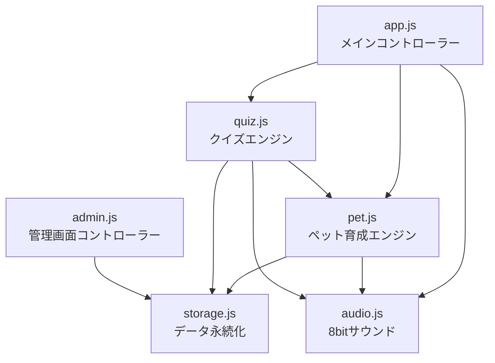
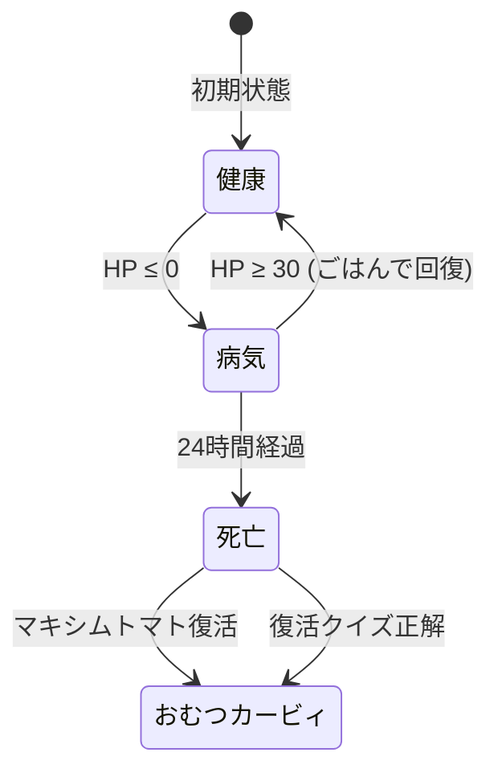
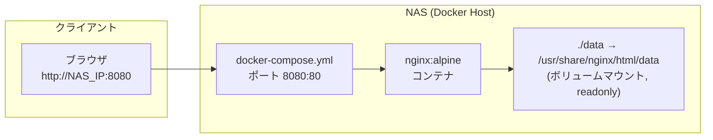

# 詳細設計書

## ⭐ ぷぷぷ育成フレンズ（たまごっち風カービィ育成×テスト復習Webアプリ）

---

## 1. モジュール構成

### 1.1 モジュール依存関係図



### 1.2 モジュール責務一覧

| モジュール | クラス/関数 | 責務 |
|-----------|------------|------|
| `storage.js` | `StorageManager` | 静的JSON読み込み、localStorage読み書き、カスタム問題CRUD |
| `pet.js` | `KirbyPet` | ペット状態管理、オフライン差分計算、ごはん・おそうじ・進化・復活・転生 |
| `quiz.js` | `QuizEngine` | 5問セッション管理、解答判定、ドロップ抽選、成績記録 |
| `audio.js` | `SoundEngine` | Web Audio APIによる8bit音声生成（ボタン・正解・不正解・すいこみ・進化等） |
| `app.js` | `KirbyApp` | 画面遷移、UIレンダリング、イベントバインディング、各モジュール統合 |
| `admin.js` | （即時実行） | 管理画面のタブ切り替え、フォーム制御、フィルタ、JSON入出力、レポート生成 |

---

## 2. クラス詳細設計

### 2.1 StorageManager（storage.js）

#### 定数

| 定数名 | 値 | 用途 |
|--------|-----|------|
| `STORAGE_KEY` | `'kirby_pet_savedata_v2'` | セーブデータのlocalStorageキー |
| `CUSTOM_Q_KEY` | `'kirby_custom_questions_v1'` | カスタム問題のlocalStorageキー |

#### プロパティ

| プロパティ名 | 型 | 説明 |
|-------------|-----|------|
| `questions` | `Question[]` | 静的JSONから読み込んだ全問題プール |
| `evolutionTree` | `EvolutionTree` | 進化ツリー定義 |
| `foods` | `Food[]` | 食べ物マスタデータ |
| `customQuestions` | `Question[]` | 親が作成したカスタム問題 |

#### メソッド

| メソッド名 | 引数 | 戻り値 | 説明 |
|-----------|------|--------|------|
| `loadAllData()` | なし | `Promise<boolean>` | 進化ツリー・食べ物・全学年問題JSONを一括fetch |
| `getDefaultSaveData()` | なし | `SaveData` | 新規セーブデータのデフォルト値を生成 |
| `loadGameData()` | なし | `SaveData` | localStorageからセーブデータを読み込み、デフォルトとマージ |
| `saveGameData(data)` | `SaveData` | `void` | `lastAccessTime`を更新してlocalStorageに保存 |
| `loadCustomQuestions()` | なし | `Question[]` | localStorageからカスタム問題を読み込み |
| `saveCustomQuestions(qs)` | `Question[]` | `void` | カスタム問題をlocalStorageに保存 |
| `addCustomQuestion(q)` | `Question` | `Question` | IDを自動生成して先頭に追加 |
| `updateCustomQuestion(id, updated)` | `string, Partial<Question>` | `boolean` | 指定IDのカスタム問題を更新 |
| `deleteCustomQuestion(id)` | `string` | `void` | 指定IDのカスタム問題を削除 |
| `getAllQuestions()` | なし | `Question[]` | 静的問題 + カスタム問題の結合配列を返す |

---

### 2.2 KirbyPet（pet.js）

#### プロパティ

| プロパティ名 | 型 | 説明 |
|-------------|-----|------|
| `storage` | `StorageManager` | データアクセス参照 |
| `saveData` | `SaveData` | 現在のセーブデータ全体 |
| `pet` | `PetState` | ペット状態オブジェクトへのショートカット |
| `currentState` | `string` | 現在のアニメーション状態（`idle`, `eating`, `happy`, `inhaling`, `evolving`, `sick`, `dead`） |
| `onStateChange` | `Function\|null` | 状態変更コールバック |
| `onEvolution` | `Function\|null` | 進化発生コールバック |
| `onRebirth` | `Function\|null` | 転生発生コールバック |
| `onDeath` | `Function\|null` | 死亡発生コールバック |

#### ゲッター

| ゲッター名 | 戻り値 | 説明 |
|-----------|--------|------|
| `formInfo` | `Evolution\|null` | 現在の進化形態の定義情報 |
| `currentSpritePath` | `string` | 現在表示すべきスプライトのパス（状態に応じて分岐） |

#### メソッド

| メソッド名 | 引数 | 戻り値 | 説明 |
|-----------|------|--------|------|
| `applyOfflineProgress()` | なし | `void` | 最終アクセスからの経過時間を計算し、うんち・空腹度・HP・病気・死亡・転生を一括シミュレーション |
| `startLifeCycle()` | なし | `void` | 60秒毎のsetIntervalでリアルタイム減少・うんち・病気・死亡を監視 |
| `save()` | なし | `void` | 現在のペット状態をlocalStorageに保存 |
| `feed(foodId)` | `string` | `FeedResult` | ごちそうを消費し、満腹度・HP・ごきげん度UP。裏パラメータ加算（基礎値±2乱数）。病気治癒判定・進化判定を実行 |
| `clean()` | なし | `CleanResult` | うんちを全て吸い込み、ごきげん度・HPを回復 |
| `playWithPet()` | なし | `void` | なでなでしてごきげん度+15 |
| `reviveWithTomato()` | なし | `ReviveResult` | マキシムトマト1個消費で復活。全ステータスリセット、おむつカービィに戻る |
| `reincarnateToBaby()` | なし | `void` | 最終進化から24h経過時の世代交代。裏パラメータをリセット（maximCountは保持） |
| `checkEvolution()` | なし | `EvolutionCheckResult` | 進化条件をチェックし、次ステージの候補を順に判定 |
| `triggerEvolution(newForm)` | `Evolution` | `void` | 進化を実行。形態ID・ステージ更新、図鑑アンロック、進化演出コールバック発火 |
| `changeForm(formId)` | `string` | `boolean` | アンロック済み形態への着せ替え |

#### オフライン差分計算の詳細ロジック

```
入力: lastAccessTime, lastCleanTime, 現在時刻 now
elapsed = (now - lastAccessTime) / 3600  // アクセス間経過時間[h]
elapsedClean = (now - lastCleanTime) / 3600 // そうじからの経過時間[h]

1. うんち増加: min(12, floor(elapsedClean)) 個に更新
2. 満腹度減少: elapsed × (100/48) ポイント
3. HP減少:
   poopMultiplier = 1.0 + (poopCount × 0.1)
   energyDrop = elapsed × (100/48) × poopMultiplier
4. ごきげん度減少: elapsed × (100/48) ポイント
5. HP ≤ 0 → isSick = true, sickStartTime を逆算
6. 病気 ≥ 24h → isDead = true
7. 最終進化 ≥ 24h → reincarnateToBaby()
```

#### 裏パラメータ加算ロジック

```
for each param in food.params:
    if baseVal >= 5:
        delta = random(-2, +2)  // 整数
        addVal = max(1, baseVal + delta)
    else:
        addVal = baseVal
    hiddenParams[param] += addVal
```

#### 進化判定ロジック

```
1. 現在のステージを取得
2. 次のステージ候補を evolution_tree から filter
3. 各候補の conditions を順にチェック:
   - minBaseExp あれば hiddenParams.baseExp >= minBaseExp か判定
   - params あれば各属性値を比較
4. 最初に全条件を満たした候補で進化確定
```

---

### 2.3 QuizEngine（quiz.js）

#### プロパティ

| プロパティ名 | 型 | 説明 |
|-------------|-----|------|
| `storage` | `StorageManager` | 問題データアクセス |
| `pet` | `KirbyPet` | 報酬・成績記録のためのペット参照 |
| `sessionQuestions` | `Question[]` | 現在セッションの5問（最大） |
| `sessionIndex` | `number` | 現在何問目か（0始まり） |
| `sessionResults` | `QuizResult[]` | 各問の結果記録 |
| `sessionRewards` | `Food[]` | セッション中に獲得したごちそう一覧 |
| `currentQuestion` | `Question\|null` | 現在出題中の問題 |
| `isRevengeMode` | `boolean` | にがてリベンジモードか |
| `isReviveMode` | `boolean` | 復活モードか（1問のみ） |

#### メソッド

| メソッド名 | 引数 | 戻り値 | 説明 |
|-----------|------|--------|------|
| `startSession(options)` | `SessionOptions` | `SessionStart\|null` | 問題プールからシャッフル抽出し、5問セッションを開始（復活時は1問） |
| `getQuestionPool(options)` | `SessionOptions` | `Question[]` | 学年・教科・カテゴリ・リベンジフラグに基づいて問題プールをフィルタ |
| `rollDropReward(baseFoodId)` | `string` | `string` | 確率に基づいてドロップアイテムIDを決定 |
| `submitAnswer(userAnswer)` | `string\|number` | `QuizResult\|null` | 解答判定。正解時はドロップ・インベントリ加算。不正解時はにがてリスト追加。成績統計更新 |
| `nextQuestion()` | なし | `NextResult` | 次の問題に進む。5問終了時はリザルト集計を返す |
| `formatAnswerDisplay(q)` | `Question` | `string` | 正解表示用のフォーマット |

#### ドロップ確率テーブル

| ドロップ | 確率 | 条件 |
|---------|------|------|
| 🍅 マキシムトマト | 10% | — |
| 🍭 むてきキャンディ | 20% | — |
| 問題指定ごちそう or ランダム | 70% | `foodReward` フィールドで指定、なければ6種からランダム |
| 🍅 マキシムトマト | 100% | 復活モード時のみ |

#### 解答判定ロジック

| 問題形式 | 判定方法 |
|---------|---------|
| `choice` / `passage` | `parseInt(userAnswer) === parseInt(q.answer)` (0始まりインデックス) |
| `fill` | 正解文字列の完全一致 + `acceptable[]` 配列での別解許容（大文字小文字無視） |
| `numeric` | `parseFloat(userAnswer) === parseFloat(q.answer)` |

---

### 2.4 SoundEngine（audio.js）

#### プロパティ

| プロパティ名 | 型 | 説明 |
|-------------|-----|------|
| `ctx` | `AudioContext\|null` | Web Audio APIコンテキスト（遅延初期化） |
| `enabled` | `boolean` | 音声ON/OFF |

#### メソッド

| メソッド名 | 説明 | 波形 | 周波数 |
|-----------|------|------|--------|
| `playButton()` | ボタン押し音 | square | 600Hz, 50ms |
| `playCancel()` | キャンセル音 | square | 300Hz, 80ms |
| `playCorrect()` | 正解ファンファーレ | triangle | C5→E5→G5→C6 (各90ms間隔) |
| `playWrong()` | 不正解音 | sawtooth | 350→300→250→200Hz (下降) |
| `playInhale()` | すいこみ効果音 | noise+bandpass | 400→1200Hz sweep, 400ms |
| `playEat()` | もぐもぐ音 | triangle | 400→600→500→750Hz |
| `playHappy()` | ごきげん音 | sine | 600→800→1000Hz |
| `playEvolution()` | 進化ファンファーレ | triangle+square | C5→E5→G5→C6→A5→C6→D6→E6 (各130ms) |

---

### 2.5 KirbyApp（app.js）

#### プロパティ

| プロパティ名 | 型 | 説明 |
|-------------|-----|------|
| `storage` | `StorageManager` | データ管理 |
| `pet` | `KirbyPet` | ペットエンジン |
| `quiz` | `QuizEngine` | クイズエンジン |
| `currentView` | `string` | 表示中のビュー名 |
| `menuCycle` | `string[]` | Cボタンでの画面巡回順序 `['home','studyMenu','food','zukan']` |
| `menuIndex` | `number` | 現在のメニュー位置 |

#### 画面遷移メソッド

| メソッド名 | 説明 |
|-----------|------|
| `switchView(viewName)` | 5つのビュー（home/studyMenu/battle/food/zukan）の排他表示切替 |
| `updateUI()` | ステータスバー、ペットスプライト、ふきだし、ステージバッジの一括更新 |
| `renderPoops()` | うんちスプライト（最大12個）を定位置に配置 |
| `renderFoodList()` | 食べ物カード一覧（裏パラメータ非表示）をレンダリング |
| `renderZukan()` | 図鑑グリッド（アンロック/ロック状態）をレンダリング |
| `renderStudyMenu()` | にがて問題数バッジを更新 |

#### 5問テストセッションメソッド

| メソッド名 | 説明 |
|-----------|------|
| `start5QuestionSession(options)` | QuizEngine.startSession()を呼び、バトル画面に遷移して第1問を描画 |
| `renderCurrentBattleQuestion(q, idx, total)` | 問題文・選択肢/入力フォーム・バトルアリーナ・進捗バッジを描画 |
| `handleQuizAnswer(answer)` | QuizEngine.submitAnswer()を呼び、正解時はすいこみアニメーション後に結果ダイアログ表示 |
| `showQuizResultDialog(res)` | 各問の正解/不正解・ごちそうドロップ・解説を表示 |
| `proceedToNextQuestion()` | QuizEngine.nextQuestion()を呼び、次問描画 or 5問完了時に総合リザルト表示 |
| `showSessionResult(summary)` | 5問の総合スコア・獲得ごちそう一覧を表示 |

#### ボタン操作マッピング

| ボタン | キーボード | ホーム画面 | バトル画面 | その他画面 |
|--------|----------|-----------|-----------|-----------|
| A | Z | おそうじ/テスト開始 | 結果ダイアログ「次へ」 | 最初の食べ物をあげる |
| B | X | — | 学習メニューに戻る | ホームに戻る |
| C | C | メニュー巡回 | — | メニュー巡回 |

---

## 3. データ構造詳細

### 3.1 セーブデータ（SaveData）

```json
{
  "selectedGrade": 5,
  "lastAccessTime": 1724741234567,
  "pet": {
    "name": "カービィ",
    "currentFormId": "baby_kirby",
    "stage": 1,
    "hunger": 100,
    "energy": 100,
    "happy": 100,
    "poopCount": 0,
    "isSick": false,
    "sickStartTime": null,
    "isDead": false,
    "deadTime": null,
    "finalEvoTime": null,
    "hiddenParams": {
      "fire": 0,
      "slash": 0,
      "spark": 0,
      "ice": 0,
      "magic": 0,
      "baseExp": 0,
      "maximCount": 0
    },
    "inventory": {
      "apple": 2,
      "chili_curry": 0,
      "sword_meat": 0,
      "spark_soda": 0,
      "ice_cream": 0,
      "magic_candy": 0,
      "star_candy": 0,
      "maxim_tomato": 1
    },
    "unlockedForms": ["baby_kirby"],
    "totalQuestionsSolved": 0,
    "correctCount": 0,
    "studyStats": {
      "算数": { "solved": 0, "correct": 0 },
      "国語": { "solved": 0, "correct": 0 },
      "理科": { "solved": 0, "correct": 0 },
      "社会": { "solved": 0, "correct": 0 },
      "英語": { "solved": 0, "correct": 0 }
    },
    "wrongQuestionIds": []
  }
}
```

### 3.2 問題データフォーマット（Question）

```json
{
  "id": "math-5-01",
  "type": "choice | fill | numeric | passage",
  "grade": 5,
  "subject": "算数",
  "unit": "小数と分数",
  "category": "general | weak | advanced",
  "monster": "waddle_dee | bronto_burt | gordo | king_dedede",
  "foodReward": "apple",
  "question": "問題文",
  "passage": "(passageタイプのみ) 長文読解テキスト",
  "options": ["選択肢1", "選択肢2", "選択肢3", "選択肢4"],
  "answer": 1,
  "acceptable": ["別解1", "別解2"],
  "hint": "ヒント文",
  "explanation": "解説文"
}
```

#### 各問題形式のanswerフィールド仕様

| 形式 | `answer` 型 | 説明 |
|------|------------|------|
| `choice` | `number` | 正解選択肢のインデックス（0始まり） |
| `passage` | `number` | 同上 |
| `fill` | `string` | 正解文字列（`acceptable[]` で別解許容） |
| `numeric` | `number\|string` | 正解の数値 |

### 3.3 進化ツリー（EvolutionTree）

```json
{
  "stages": [
    { "stage": 1, "name": "おむつ期（ベビー）", "description": "..." },
    { "stage": 2, "name": "成長期（ノーマル）", "description": "..." },
    { "stage": 3, "name": "単能力期（シングル）", "description": "..." },
    { "stage": 4, "name": "複合能力期（マスターミックス）", "description": "..." }
  ],
  "evolutions": [
    {
      "id": "baby_kirby",
      "stage": 1,
      "name": "おむつカービィ",
      "title": "ばぶばぶカービィ",
      "description": "...",
      "themeColor": "#ffb6c1",
      "spriteKey": "baby",
      "conditions": { "isDefault": true }
    }
  ]
}
```

#### 進化条件一覧

| ID | ステージ | 名前 | 条件 |
|----|---------|------|------|
| `baby_kirby` | 1 | おむつカービィ | デフォルト（初期形態） |
| `normal_kirby` | 2 | 普通カービィ | baseExp ≥ 25 |
| `fire_kirby` | 3 | ファイアカービィ | fire ≥ 30 |
| `sword_kirby` | 3 | ソードカービィ | slash ≥ 30 |
| `spark_kirby` | 3 | スパークカービィ | spark ≥ 30 |
| `ice_kirby` | 3 | アイスカービィ | ice ≥ 30 |
| `wizard_kirby` | 3 | ドクターカービィ | magic ≥ 30 |
| `burning_sword_kirby` | 4 | バーニングソード | fire ≥ 35 && slash ≥ 35 |
| `spark_cutter_kirby` | 4 | スパークブレード | slash ≥ 35 && spark ≥ 35 |
| `frost_spark_kirby` | 4 | フロストボム | ice ≥ 35 && spark ≥ 35 |
| `star_legend_kirby` | 4 | スターロッド・レジェンド | 全属性 ≥ 25 |

### 3.4 食べ物マスタ（Food）

| ID | 名前 | アイコン | 満腹度 | ごきげん | 裏パラメータ効果 |
|----|------|---------|--------|---------|----------------|
| `apple` | リンゴ | 🍎 | +20 | +15 | baseExp+10 |
| `chili_curry` | からくちカレー | 🍛 | +30 | +20 | fire+15, baseExp+5 |
| `sword_meat` | まんが肉 | 🍖 | +35 | +25 | slash+15, baseExp+5 |
| `spark_soda` | でんげきソーダ | 🥤 | +15 | +25 | spark+15, baseExp+5 |
| `ice_cream` | ソフトクリーム | 🍦 | +20 | +30 | ice+15, baseExp+5 |
| `magic_candy` | マジックキャンディ | 🍬 | +10 | +30 | magic+15, baseExp+5 |
| `star_candy` | むてきキャンディ | 🍭 | +15 | +40 | 全属性+8, baseExp+10 |
| `maxim_tomato` | マキシムトマト | 🍅 | +100 | +100 | 全属性+15, baseExp+30, maximCount+1 |

> **注**: 裏パラメータの加算値は基礎値±2の乱数範囲。例: fire+15 → 実際は13〜17の範囲でランダム

---

## 4. ライフサイクルパラメータ詳細

### 4.1 時間経過パラメータ

| パラメータ | 減少レート | ゼロ到達時間 | 備考 |
|-----------|-----------|------------|------|
| 満腹度（hunger） | 2.08%/h | 48時間 | 0%でも即座にはペナルティなし |
| HP（energy） | 2.08%/h × うんち倍率 | 48時間（クリーン時） | 0%で病気に移行 |
| ごきげん度（happy） | 2.08%/h | 48時間 | 進化判定・ふきだしに影響 |

### 4.2 うんちシステム

| 項目 | 値 |
|------|-----|
| 蓄積レート | そうじから1時間に1個 |
| 最大数 | 12個 |
| HP減少加速 | うんち1個あたり +0.1倍（12個で2.2倍） |
| おそうじ効果 | 全除去、ごきげん度 +5×個数、HP +10 |

### 4.3 病気・死亡・復活



### 4.4 世代交代（転生）

| 項目 | 仕様 |
|------|------|
| 発動条件 | 第4形態到達から24時間後 |
| リセット対象 | currentFormId→baby_kirby, stage→1, 全裏パラメータ→0 |
| 保持対象 | maximCount, unlockedForms, studyStats, wrongQuestionIds, inventory |
| 回復 | energy→100, hunger→80, happy→100, poopCount→0 |

---

## 5. 画面レイアウト詳細

### 5.1 ゲーム画面構成（index.html）

```
┌──────────────────────────────────┐
│ ⭐ PUPUPU FRIENDS ⭐  [⚙管理]  │ ← デバイスヘッダー
├──────────────────────────────────┤
│ 🍖100% 💖100% 💩0 おむつカービィ │ ← LCDステータスバー
├──────────────────────────────────┤
│                                  │
│    💬 ぽよ！元気いっぱい！       │
│                                  │
│         [カービィスプライト]       │ ← お部屋ステージ
│                                  │
│    第1形態: おむつ期              │
│    5問テストを解いてごちそうを...  │
│                                  │
│  [🧹おそうじ] [🍙ごはん] [✏テスト] │ ← アクションバー
├──────────────────────────────────┤
│   [A決定]    [Bもどる]   [Cメニュー] │ ← ハードウェアボタン
└──────────────────────────────────┘
```

### 5.2 バトル画面構成

```
┌──────────────────────────────────┐
│ 第 1/5 問 │ 算数/小数 │ 4択     │ ← 進捗バッジ
├──────────────────────────────────┤
│                                  │
│  [カービィ]  ←吸い込み→  [敵]   │ ← バトルアリーナ
│                                  │
├──────────────────────────────────┤
│ 3/4を小数で表すとどれ？          │ ← 問題文
│                                  │
│ [1. 0.34] [2. 0.75]             │ ← 選択肢グリッド
│ [3. 0.43] [4. 1.25]             │
└──────────────────────────────────┘
```

### 5.3 管理画面構成（admin.html）

```
┌──────────────────────────────────────────────┐
│ ⚙️ ぷぷぷ育成フレンズ 問題管理    [🎮戻る]  │ ← ナビバー (紫グラデ)
├──────────────────────────────────────────────┤
│ [📝とりあえず] [⚠にがて] [🚀1学年上] [📊レポ] │ ← 区分タブ
├───────────────────────┬──────────────────────┤
│ ➕ 新しい問題を登録   │ 📋 登録済み問題一覧  │
│                       │                      │
│ 学年: [小5▼] 教科:   │ [📤JSON] [📥Import]  │
│ [算数▼]               │ 学年:[▼] 教科:[▼]   │
│                       │ [🔍検索...]          │
│ 問題文:               │                      │
│ [____________]        │ ┌─ Q1 ────────────┐  │
│                       │ │ 小5 算数 4択     │  │
│ 選択肢:               │ │ 3/4を小数で...   │  │
│ [1:___] [2:___]       │ │ [✏編集] [🗑削除] │  │
│ [3:___] [4:___]       │ └──────────────────┘  │
│                       │                      │
│ 正解: [▼]             │ ┌─ Q2 ────────────┐  │
│ 解説: [____________]  │ │ ...              │  │
│                       │ └──────────────────┘  │
│ [💾 保存する]         │                      │
└───────────────────────┴──────────────────────┘
```

---

## 6. アセット一覧

### 6.1 スプライト（assets/sprites/）

| ファイル名 | 種別 | 説明 | 使用場面 |
|-----------|------|------|---------|
| `pet_baby.webp` | ペット | おむつカービィ（ハイハイ） | ステージ1 |
| `pet_normal.webp` | ペット | 普通カービィ（バウンス） | ステージ2 |
| `pet_fire.webp` | ペット | ファイアカービィ | ステージ3（fire） |
| `pet_sword.webp` | ペット | ソードカービィ | ステージ3（slash） |
| `pet_spark.webp` | ペット | スパークカービィ | ステージ3（spark） |
| `pet_ice.webp` | ペット | アイスカービィ | ステージ3（ice） |
| `pet_wizard.webp` | ペット | ドクターカービィ | ステージ3（magic） |
| `pet_burning_sword.webp` | ペット | バーニングソード | ステージ4 |
| `pet_spark_cutter.webp` | ペット | スパークブレード | ステージ4 |
| `pet_frost_spark.webp` | ペット | フロストボム | ステージ4 |
| `pet_star_legend.webp` | ペット | スターロッド・レジェンド | ステージ4 |
| `pet_eating.webp` | アクション | もぐもぐ | ごはん中 |
| `pet_inhale.webp` | アクション | すいこみ | クイズ正解時/おそうじ |
| `pet_sick.webp` | 状態 | 病気 | isSick = true |
| `pet_ghost.webp` | 状態 | おばけ | isDead = true |
| `poop.webp` | オブジェクト | うんち | poopCount > 0 |
| `enemy_waddle_dee.webp` | 敵 | ワドルディ | クイズバトル |
| `enemy_bronto_burt.webp` | 敵 | ブロントバート | クイズバトル |
| `enemy_gordo.webp` | 敵 | ゴルドー | クイズバトル |
| `enemy_king_dedede.webp` | 敵 | デデデ大王 | クイズバトル |

### 6.2 生成ツール

| ツール | ファイル | 説明 |
|--------|---------|------|
| `generate_pixel_assets.py` | Python + Pillow | 32×32ドット絵を8フレームアニメーションWebPとして生成 |

---

## 7. デプロイ構成

### 7.1 Docker構成



### 7.2 nginx.conf 設定

| 設定項目 | 値 | 目的 |
|---------|-----|------|
| listen | 80 | コンテナ内部ポート |
| JSON Cache-Control | `no-cache, no-store, must-revalidate` | 問題データ更新を即座に反映 |
| フォールバック | `try_files $uri $uri/ /index.html` | SPA対応 |

### 7.3 ローカル開発サーバー（serve.js）

| 設定項目 | 値 | 目的 |
|---------|-----|------|
| 初期ポート | 3000 | 開発用デフォルト |
| ポートリトライ | +1ずつ自動試行 | EADDRINUSE対策 |
| MIME対応 | `.html`, `.js`, `.css`, `.json`, `.webp`, `.png`, `.jpg`, `.svg` | 静的ファイル配信 |
| JSONキャッシュ | `no-cache` | 問題編集後の即時反映 |

---

## 8. 拡張ポイント

### 8.1 進化の追加方法

1. `data/evolution_tree.json` の `evolutions` 配列に新しい形態を追加
2. `generate_pixel_assets.py` に新形態のドット絵描画関数を追加
3. `python generate_pixel_assets.py` を実行してWebPを生成

**追加に必要なフィールド:**
```json
{
  "id": "新形態ID",
  "stage": 3,
  "name": "表示名",
  "title": "肩書き",
  "description": "図鑑説明文",
  "themeColor": "#カラーコード",
  "spriteKey": "スプライトファイル名(pet_XXX.webpのXXX部分)",
  "conditions": {
    "requiredStage": 2,
    "params": { "属性名": 必要値 }
  }
}
```

### 8.2 問題データの追加方法

1. `data/` ディレクトリにJSON ファイルを追加
2. `storage.js` の `dataFiles` 配列にファイル名を追加
3. 問題フォーマットの各フィールドを正しく記述

### 8.3 食べ物の追加方法

1. `data/foods.json` の `foods` 配列に新アイテムを追加
2. `storage.js` の `getDefaultSaveData()` 内の `inventory` にID: 0を追加
3. `quiz.js` の `rollDropReward()` の `regularPool` に追加

### 8.4 敵キャラの追加方法

1. `generate_pixel_assets.py` に新敵描画関数を追加
2. WebPを `assets/sprites/enemy_XXX.webp` として生成
3. 問題データの `monster` フィールドに `"XXX"` を指定
